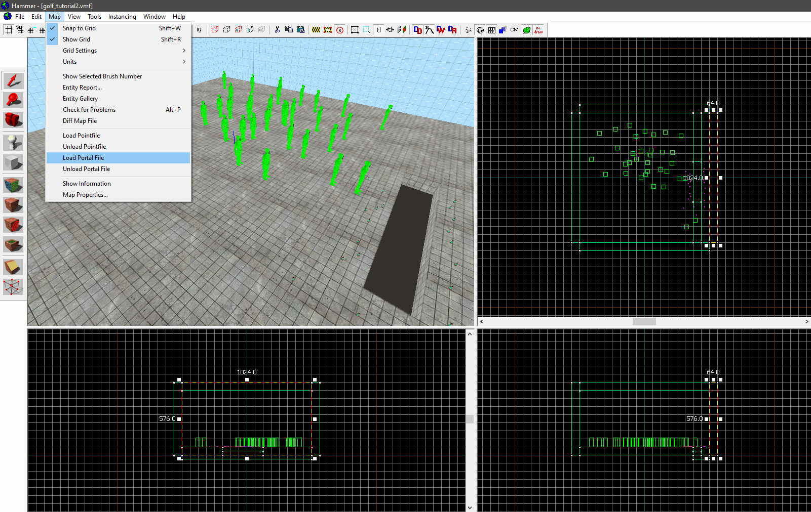
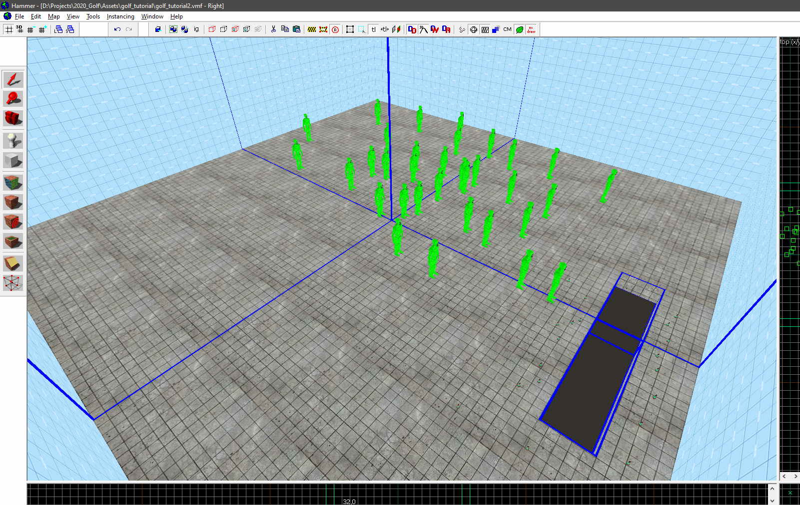
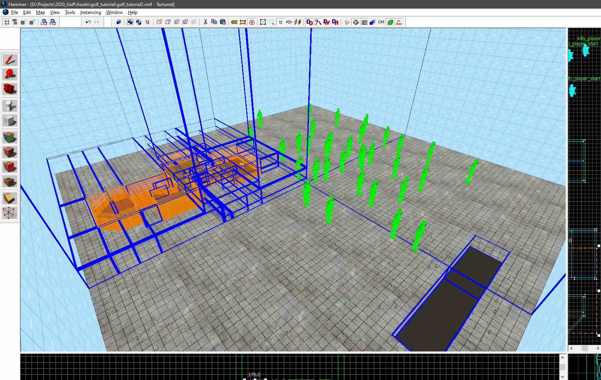
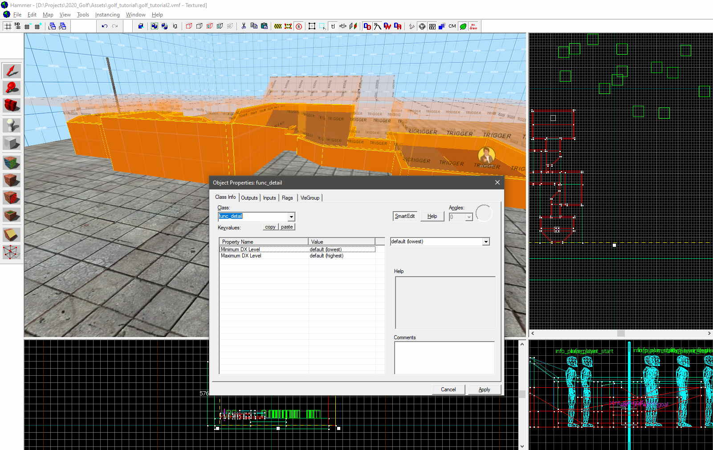

# Mapping for MiniGolf
The mapper has full control of the minigolf tracks using the scripted entities (SENTs) specified in the chapter below.

## Examples

* Almost complete desert map by Timothy: [golf_desert_alpha14.vmf](https://mega.nz/file/0pQ2xCwK#-sucFspNSbrhFL7TbZAinv_wLFnUuCdO01CW_EYvAWI) ([compiled .bsp](https://mega.nz/file/UoBQDK5C#hddIisUFQx76LGsxLu3vmodgJi3qLebt9OEEnZkX2cg))

* Experimental map by Elkinda: [golf_test_course21.vmf](https://mega.nz/file/k9I0zQbJ#dPyflT2VTlAb-5rNSg8Xos5r7DuNkqeNw9tnWiy_p9s) ([compiled .bsp](https://mega.nz/file/I5QwnSyZ#gwDysjK2NCMgydm7Tf9yuL2K-E6sVF7LhX5iFdl6lDE))

* Minimal development map by Timothy: [golf_dev_minimal_v3.vmf](https://mega.nz/file/plRx0QhI#fRTKcXxUoKOdpZDczYsg_1hxx-KaR26JkuDEyPmEQ2Q) ([compiled .bsp](https://mega.nz/file/o0JXVaqZ#qXpBKSirzDj_IfVMcTLIQyHJe3Uwk-DCkZATkFlJWH4))

* Community Map: [golf_garage_league_start2.vmf](https://mega.nz/file/8gJ21QwL#a7IkniJWbvy709oF_VnMP7pTMm_zS59woA2xpyfguew) ([compiled .bsp](https://mega.nz/file/0wBgVaCC#eFux76pG3qXKuXkoia18Lb6d83eT3aj9i0PEJRTygfk))
  * Holes by (garage boxes 0 through 7, 10 and 11 are free):

    8. **Elkinda's "Terrain"**
    9. **Timothy's "Bouncer"**

## Scripted Entity Reference

* Start entity: `minigolf_hole_start`
  * Describes where players start to play on a minigolf track (by pressing `USE` on it). The hole and description are displayed on the players' GUI.
  * These following properties are valid for this entity:
    * `par`: how many strokes is average (default: 3)
    * `hole`: the name (required)
    * `course`: the name of the course this hole is on, for when there are multiple courses on one map (default: "", (an empty string))
    * `order`: an incrementing number, lower numbers appear sooner on the scoreboard (always grouped by course)
    * `limit`: time limit in seconds (default: 60)
    * `description`: a description for the hole
    * `maxStrokes`: how many strokes are allowed before the game ends automatically (default: 12)
    * `maxPitch`: how many degrees pitch a player can make a lob shot at, don't specify or set as 0 to indicate no lob shots allowed (default: 0)
  * How to create this Point Entity in hammer:
    1. In hammer [spawn a new Point Entity](https://developer.valvesoftware.com/wiki/Entity_Creation) and select it
    2. [Open the object properties by pressing `Ctrl + Enter`](https://developer.valvesoftware.com/wiki/Hammer_Object_Properties_Dialog)
    3. In the `Class` dropdown select all text and remove it, typing `minigolf_hole_start` instead. The entity will always have the [`Obsolete` icon](https://developer.valvesoftware.com/wiki/Obsolete)
    4. Turn of `SmartEdit` by clicking the button
    5. Click `Add`
    6. Now type in the properties listed above under `Key`. 
    7. Give your desired value under `Value` then click OK to finalize your configuration.
    8. When the map is loaded by the gamemode these values are stored in memory.
* End brush: `minigolf_hole_end`
  * Specifies the end/goal/hole. When the ball touches this brush the player will have reached the end in as many strokes as they have up to that point.
  * Because of this design, in theory it's possible (untested) to have a hole with a single start and multiple valid ends (that all point to the same start.)
  * These following properties are valid for this entity: 
    * `hole`: the name (must match a start hole’s name)
    * `course`: the name of the course this hole is on (must match a start hole’s course name if the start hole has one set)
  * How to create this Brush Entity in hammer:
    1. Create one or multiple brushes in Hammer, along the edge and over the top of the minigolf track. 
    2. Give these brushes the 'trigger' material on all faces. 
    3. Now press [`Ctrl + T` to tie it to an entity](https://developer.valvesoftware.com/wiki/Hammer_Tools_Menu#Tie_to_Entity_.3CCtrl.2BT.3E)
    4. Choose `minigolf_hole_end` as the entity type by typing it into the class name.
* Hole flag entity: `minigolf_hole_flag`
  * This entity adds a flag to a hole. When the player comes near the flag it will raise, allowing them to see the ball better around the hole area.
  * To create this entity:
    1. Create a point entity with the class `minigolf_hole_flag`
    
    2. Rotate the entity in the object properties menu to change the rotation of the flag relative to the top(x/y) view:
    
       
    
    3. Make sure the entity is touching the related `minigolf_hole_end`
* Out of bounds brush: `minigolf_trigger_oob`
  * When the ball touches this brush the ball is considered Out-Of-Bounds. The ball will be reset to the last valid position.
  * There are no properties for this entity.

## Tips & Problems

### Prevent your compile time from skyrocketing

Source Engine is great at optimizing games for computers with non-ideal hardware. Some of this optimizing is done before-hand, for example when compiling the map. **If you notice that compilation is taking longer than half a minute you should check the following.**

1. Compile your map (`File > Run Map`)
2. In Hammer, go to `Map > Load Portal File`
  
3. A simple healthy map looks like this:
  
4. Let's create a minigolf hole in it, compile and then reload our portal file:
  
5. To fix this we will tie the brushes that make up the minigolf track to a `func_detail` entity (select all those brushes and press `Ctrl + T`):
  
6. After we compile again and re-load our portal file we see that it has helped to reduce portals:
  

_[Click here to read more about how these portals optimize the game](https://developer.valvesoftware.com/wiki/Visibility_optimization), as well as to see why we don't need them around our minigolf tracks_